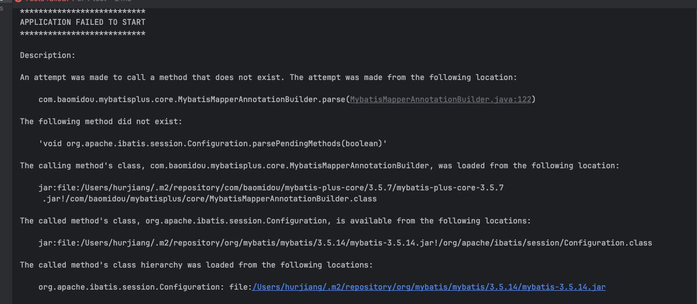

# What is this project?

# Process of project in a company

1. demand
2. design
3. technology
4. initial
5. demo
6. code/basic logic
7. test (unit test)
8. code ausgeben
9. deploy
10. build


## 1. Demand

- login/register
- user administraion (only for admin accessible): search, edit user
- 用户校验: only for vip who has paid

## 2. Technology

- frontend
  - 3 + react + 组件库 ant design + umi + ant design pro(administration system)
- backend
  - java + spring + springmvc + mybatis + mybatis plus + springboot + mysql
- deploy
  - server / containers (plattform)

## Plan

1. initiate project
   1. frontend init
      1. init project
      2. 组件
      3. framework / 
   2. backend init
      1. prepare environment (mysql...)
      2. framework
2. login/register
   1. frontend
   2. backend
3. user administration


# Note

## From very begining

Create a folder where we want to store the project and use terminal to direct to this directory, for example "project_user_center". 

## 1. Initialization

### Frontend

- Get Web Strom as tool for coding of frontend

- We will use "Ant Design Pro" as the the basis to start the project, so go to website: https://pro.ant.design/docs/getting-started and install the project in the directory "project_user_center" using command line.

  - Troubleshootings: There might be some troubles during installation
    - When i run this command `npm i @ant-design/pro-cli -g`, i was told there is ERROR from npm side. What I found out is because of version of npm. So i use nvm to install the newest version of node (npm will be updated automatically). nvm is a package manager, after install new node it automatically use the new version, so don't need to change it by your own. And then run this command again: `npm i @ant-design/pro-cli -g`, it will work (for me). 
  - Don't forget to install dependencies as well. It is introduced also in the doc of "Ant Design Pro", read it carefully.

- Now, we can see there is a new directory which has been created during installization of "Ant Design Pro" called "frontend_app" (by default was "myapp", you can change it when you run this command `pro create myapp`.) And all docs are in this directory.

- Use Web Strom to open this folder. Run the project.

  

### Backend

- Get IDEA as tool for coding of backend

- Use Spring Initlizer directlich from IDEA

- Download Mysql

- Connect local mysql with the project in IDEA

  

- config application.yml, it should be originally named application.properties, you can also write like me at the begining: 

  ```yaml
  spring:
    application:
      name: backend_app
    # DataSource Config
    datasource:
      driver-class-name: com.mysql.cj.jdbc.Driver
      url: jdbc:mysql://localhost:3306/hurryclear
      username: 
      password: 
  server:
    port: 8080
  
  ```

- MyBatis-Plus

  - We will use MyBatis-Plus to "operate" database, so we need to get all dependencies, components and etc. first. Follow "Quick Start" in the website: https://mybatis.plus/en/guide/.

- Spring/Springboot

- Troubleshooting

  - version problem

    

    

    

### Database Design (MySQL)

- Use console 

```sql
create table user
(
    id           bigint auto_increment
        primary key,
    username     varchar(256)  null,
    userAccount  varchar(256)  null,
    gender       tinyint       null,
    avatarUrl    varchar(1024) null,
    userPassword varchar(512)  not null,
    phone        varchar(128)  null,
    email        varchar(512)  null,
    userStatus   int default 0 not null comment '0 is good status',
    createTime   datetime   default current_timestamp    null,
    updateTime   datetime default current_timestamp null on update current_timestamp,
    isDelete     tinyint default  0  not null

);
```

## 2. Layers in backend

What's difference and functions between different layers?


## 3. Register

### 3.1 Plugin: MyBatis-X

- This plugin will help to automatically generate the basic models, mappers, service, it saves time.

  - domain
  - mapper
  - mapper.xml: define mapper object and connection with database, can write SQL
  - service: basic add/delete/edit/search
  - servicelmpl: 

- right-click the database table:

  

- set up like this: 

  

  

- it will generate the file we need and we just need to move them into the corresponding folders.

  

### 3.2 UserServiceImpl.java: userRegister


### 3.3 UnitTest for UserService

Unit Test Class for UserService: to test the save/search/add/delete function and interaction with database

### 3.4 Questions

- What is folder "impl"?
- What is "UserMapper.xml" in resources folder?
- map-underscore-to-camel-case in mybatis


## 4. Login

### *How to know which user login?


## 5. Search&Delete


